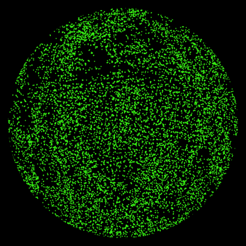

# Data visualization

Just a collection of python scripts for visualizing data.

# Barycentric legend

Given a pixel density and number of rows the script creates a triangular RGB legend based off
barycentric coordinates, useful when mapping trivariate data where variables always add to 1,
like [soil texture](https://en.wikipedia.org/wiki/Soil_texture).

## Script:
	barycentric_triangle_legend.py

## Requirements:
	- numpy
	- pycairo

10 Rows          | 25 Rows  | 50 rows
:-------------------------:|:-------------------------:|:-------------------------:
  |  | 

## LiDAR Ray Tracer
This is some simple code to do ray tracing to detect collisions with a LiDAR point cloud. The idea behind it
was to generate pseudo-hemispherical images to estimate light transmittance through a forest canopy from 
airborne LiDAR data.

## Script:
	ray_tracer.py
	ray_tracer_plot_results.py	

## Requirements:
	- numpy
	- matplotlib

Here is an example of the ray tracer results as you move through a canopy from the forest floor to
the top of the canopy in 1 meter increments. Each LiDAR point was randomly assigned a leaf angle
from a spherical distrbution.

