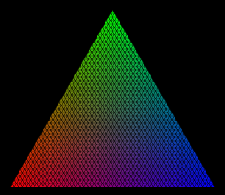

# Data visualization

Just a collection of python scripts for visualizing data.

# Barycentric legend

*barycentric_triangle_legend.py*

Creates a triangular legend based off barycentric coordinates, useful when mapping trivariate data
where variables always add to 1, like  [soil texture](https://en.wikipedia.org/wiki/Soil_texture).

Given pixel density and number of rows in the triangle create a RGB legend.

Scale:200 Rows: 10

Scale:200 Rows: 25

Scale:200 Rows: 50

